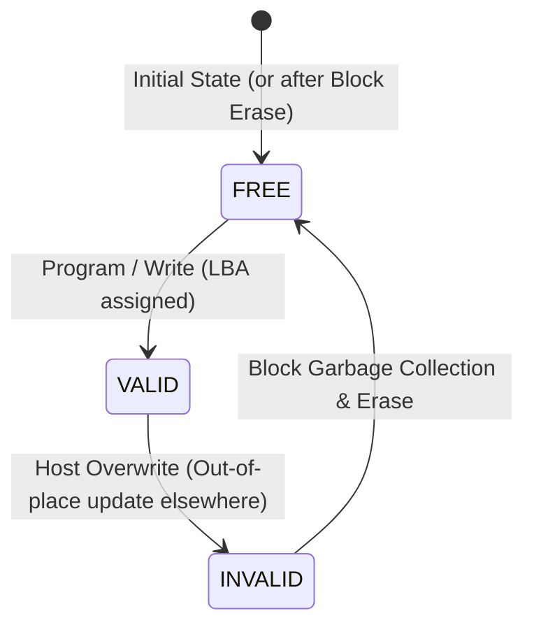

# Flash Write Amplification Simulator (FlashWAF)

[](https://www.python.org/downloads/)
[](https://opensource.org/licenses/MIT)
[]()
[]()

A high-fidelity Python simulation of **NAND Flash Memory**, the **Flash Translation Layer (FTL)**, and the **Write Amplification Factor (WAF)** under varying workload patterns.

The simulator investigates the physical mismatch between page-level writes and block-level erasures, evaluates **user-space ring buffering** to aggregate small writes into full flash pages, and models the fundamental trade-off between **Write Amplification reduction** and **data durability** under sudden power loss.

---

## The Research Premise

### 1. The Physical Asymmetry of NAND Flash
NAND flash memory operates under an intrinsic physical asymmetry:
* **Reads and Programs (Writes)** occur at **Page granularity** (e.g., $4\text{ KiB}$).
* **Erasures** occur only at **Block granularity** (e.g., $64\text{ pages} = 256\text{ KiB}$).

Because flash floating-gate/charge-trap cells cannot be reprogrammed from $0$ back to $1$ without a high-voltage substrate erase pulse across the whole block, **in-place overwrites are physically impossible**.

### 2. Out-of-Place Updates & Garbage Collection (GC)
When a host updates an existing Logical Block Address (LBA):
1. The FTL writes the new data to a fresh `FREE` physical page.
2. The old physical page is marked `INVALID` (stale/dead).
3. The Logical-to-Physical (L2P) translation table is updated to point to the new coordinate.

As free blocks become exhausted, the drive must perform **Garbage Collection (GC)**:
* Select a "victim block" with obsolete pages.
* Copy any remaining `VALID` pages to a new block.
* Erase the victim block to reclaim free space.

These internal copy operations cause **Write Amplification (WAF)**:
$$\text{WAF} = \frac{\text{Total Physical Bytes Programmed to Flash}}{\text{Total Host Logical Bytes Written}} = \frac{(\text{Physical Writes} + \text{GC Page Copies}) \times \text{Page Size}}{\text{Host Bytes Written}}$$

Each block has a finite Program/Erase (P/E) endurance cycle limit before silicon oxide breakdown occurs. High WAF prematurely degrades SSD lifespan.

### 3. The Proposed Solution & Durability Trade-Off
* **Mechanism:** An in-memory **ring buffer** aggregates small host writes (e.g., 128 bytes) into full $4\text{ KiB}$ pages before issuing physical program commands to the FTL.
* **The Engineering Trade-Off:** Buffering dramatically reduces WAF and block erasures. However, holding unwritten dirty records in volatile RAM introduces a **durability risk**: uncommitted buffer data is lost if a sudden power loss occurs prior to flushing.

---

## Architecture & State Model (Phase 1)

```
+---------------------------------------------------------------------------------+
|                                 FlashSimulator                                  |
|   Geometry: 64 Blocks x 64 Pages = 4,096 Physical Pages (16 MiB @ 4 KiB/page)    |
|   L2P Mapping: Host LBA (int) -> (block_idx, page_idx)                          |
|   Hardware Counters: physical_page_writes, gc_page_copies, block_erasures       |
+---------------------------------------------------------------------------------+
          |
          | Contains 64 Erase Blocks
          v
+---------------------------------------------------------------------------------+
| Block (Erase Unit: 256 KiB)                                                     |
|   - block_id: int                                                               |
|   - erase_count: tracks P/E cycles                                              |
|   - pages: List[Page] (64 pages)                                                |
|   - Properties: free_page_count, valid_page_count, invalid_page_count           |
|   - erase(): resets all pages to FREE and increments erase_count                |
+---------------------------------------------------------------------------------+
          |
          | Contains 64 Program Pages
          v
+---------------------------------------------------------------------------------+
| Page (Program Unit: 4 KiB)                                                      |
|   - state: FREE (erased) | VALID (active data) | INVALID (stale data)           |
|   - lba: Host Logical Address (reverse pointer in OOB spare area)               |
|   - data: Arbitrary payload                                                     |
|   - reset(): resets to FREE state                                               |
+---------------------------------------------------------------------------------+
```

### Page State Lifecycle



* **`FREE`**: Freshly erased, ready to be programmed.
* **`VALID`**: Holds live host data mapped in the L2P table.
* **`INVALID`**: Obsolete data superseded by a newer write. Awaits Garbage Collection.

---

## Repository Structure

```text
flash-write-amplification/
├── flash_sim/
│   ├── __init__.py           # Package exports (PageState, Page, Block, FlashSimulator)
│   ├── models.py             # Core dataclasses: PageState, Page, Block
│   └── simulator.py          # FlashSimulator engine with L2P and hardware counters
├── tests/
│   ├── __init__.py
│   └── test_phase1.py        # 13 pytest unit tests for state transitions and invariants
├── demo_phase1.py            # Interactive walkthrough and state demonstration
├── pyproject.toml            # Project packaging metadata and pytest configuration
├── requirements.txt          # Runtime dependencies
├── LICENSE                   # MIT License
└── README.md                 # Project documentation and roadmap
```

---

## Getting Started

### 1. Prerequisites
* Python 3.9 or newer.

### 2. Installation
Clone the repository and install dependencies:
```bash
git clone https://github.com/arnavpandya/flash-waf-sim.git
cd flash-waf-sim
pip install -r requirements.txt
pip install -e ".[dev]"
```

### 3. Run the Test Suite
Ensure all 13 Phase 1 unit tests pass:
```bash
pytest
```

Output:
```text
tests/test_phase1.py::test_page_initialization_defaults PASSED
tests/test_phase1.py::test_page_state_transitions PASSED
tests/test_phase1.py::test_page_reset PASSED
tests/test_phase1.py::test_block_initialization PASSED
tests/test_phase1.py::test_block_page_state_counts PASSED
tests/test_phase1.py::test_block_erase PASSED
tests/test_phase1.py::test_simulator_default_dimensions PASSED
tests/test_phase1.py::test_all_pages_initialize_as_free PASSED
tests/test_phase1.py::test_hardware_counters_initialize_to_zero PASSED
tests/test_phase1.py::test_l2p_mapping_initializes_empty PASSED
tests/test_phase1.py::test_page_object_independence PASSED
tests/test_phase1.py::test_get_page_bounds_checking PASSED
tests/test_phase1.py::test_custom_dimensions PASSED

============================== 13 passed in 0.03s ==============================
```

### 4. Run the Phase 1 Interactive Demo
Run the demonstration script to inspect block states, page updates, and block erasure:
```bash
python3 demo_phase1.py
```

---

## Research Roadmap

| Phase | Description | Status |
| :--- | :--- | :---: |
| **Phase 1** | **Storage Data Structures & State Model**<br>Dataclasses for `Page` and `Block`, 3-state lifecycle, `FlashSimulator` with L2P mapping and hardware counters, full `pytest` suite. | **Completed** |
| **Phase 2** | **Page Allocation & Greedy Garbage Collection**<br>`write_logical_page(lba, data)`, out-of-place invalidation, greedy victim block selection, valid page relocation, erase cycling. | **Completed** |
| **Phase 3** | **Ring Buffering & Workload Simulation**<br>`RingBuffer` implementation (128-byte to 4 KiB aggregation), synthetic random update workloads (3.2 MB), baseline vs. buffered WAF comparison. | *Next* |
| **Phase 4** | **Durability Modeling & Wear Heatmaps**<br>Sudden power loss simulation, uncommitted byte loss quantification across flush policies, `matplotlib` wear heatmaps. | *Planned* |

---

## License

This project is licensed under the MIT License — see the [LICENSE](LICENSE) file for details.

