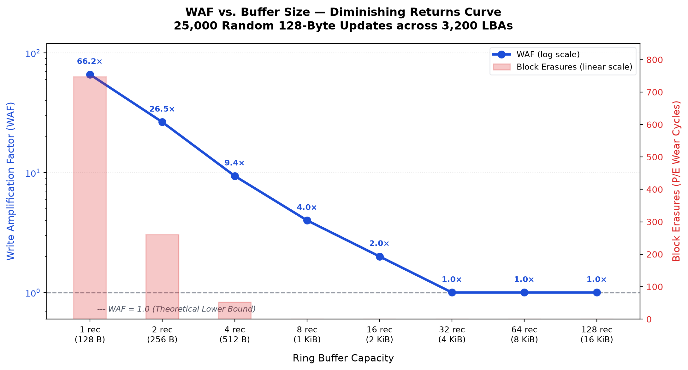
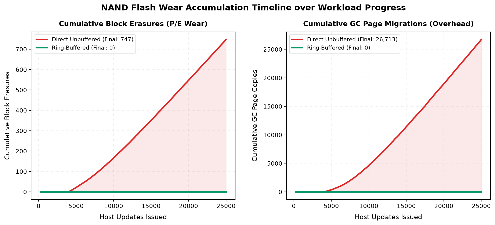
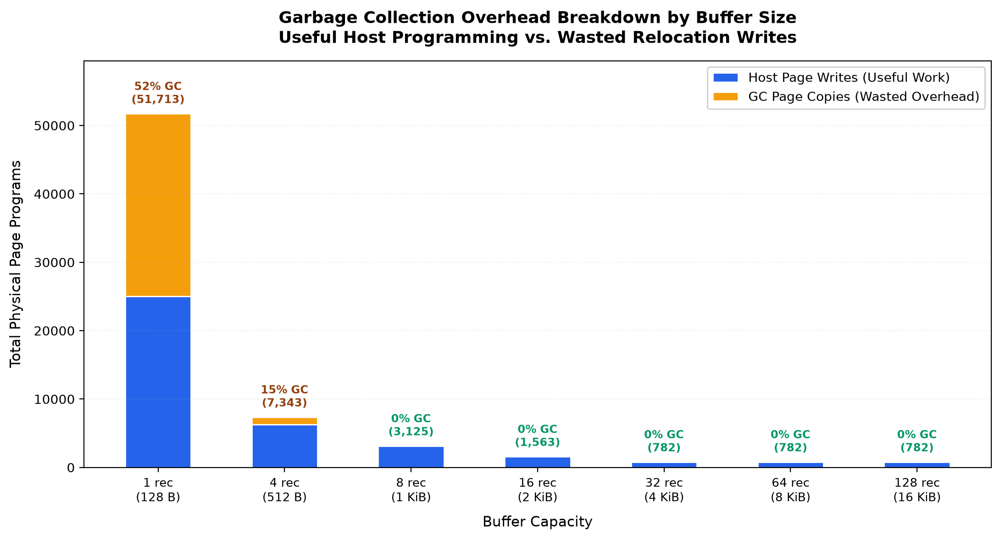
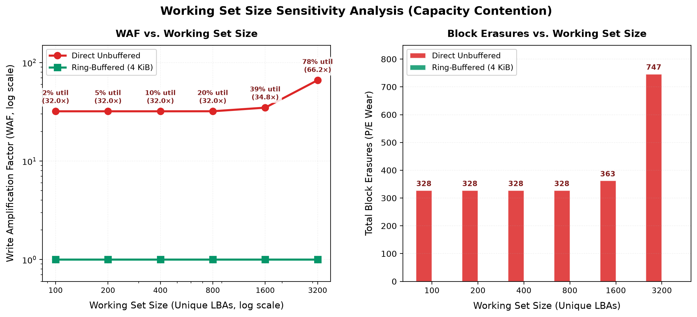
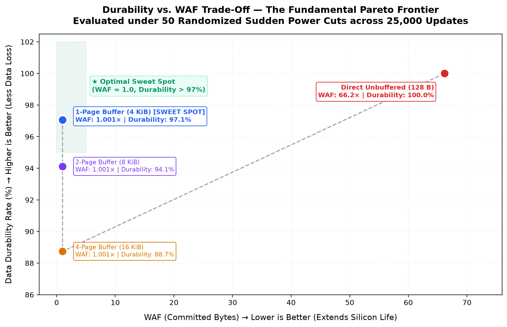
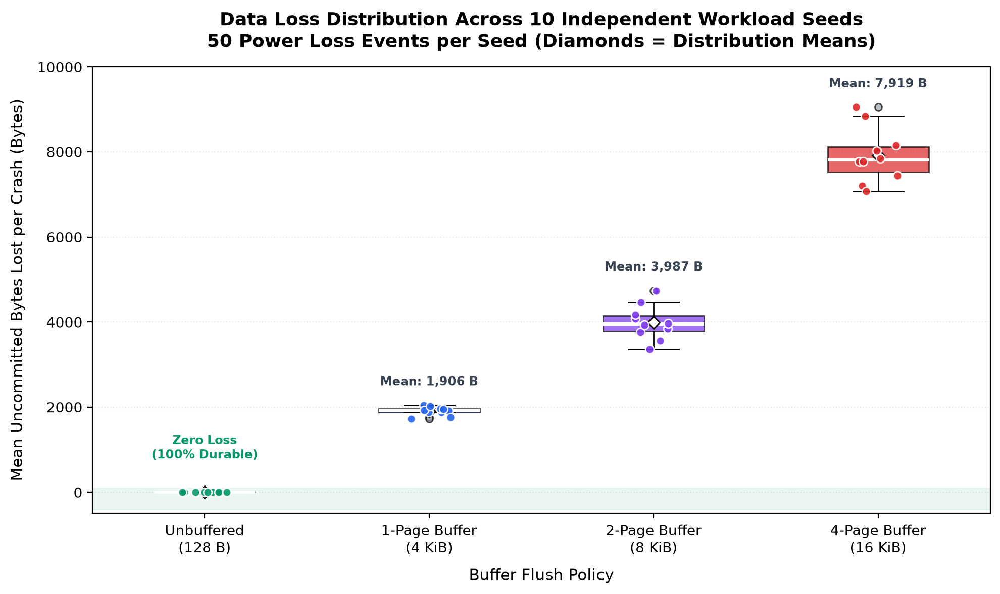
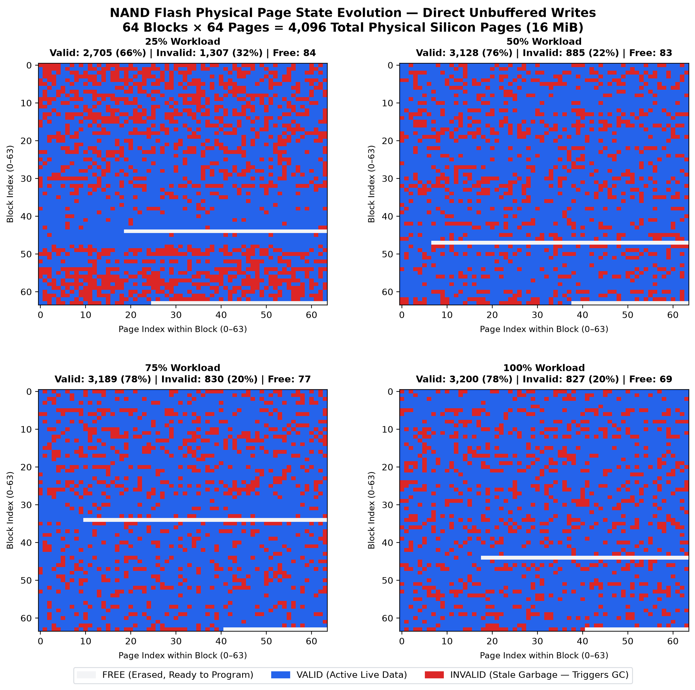
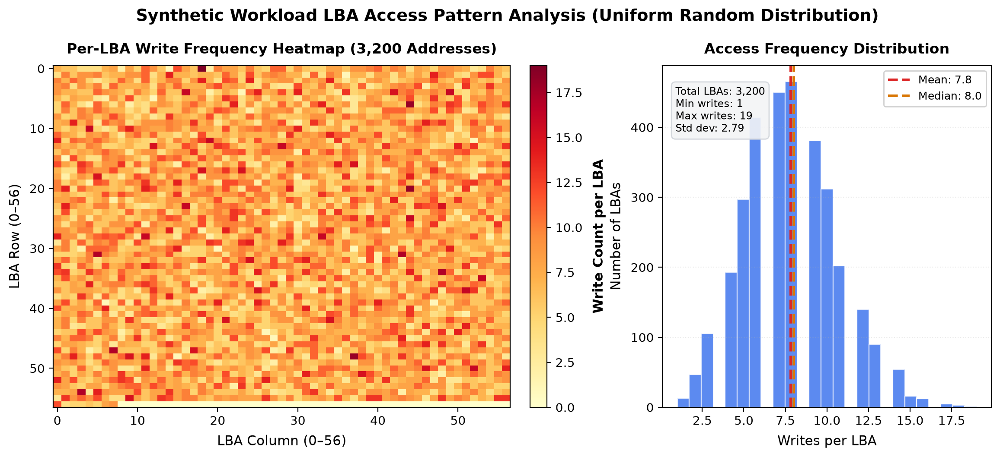
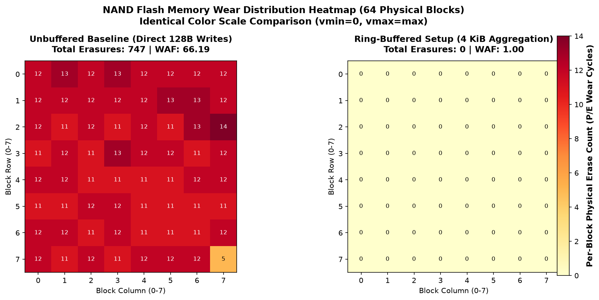

# FlashWAF: NAND Flash & Write Amplification Simulator

A discrete-event simulation of NAND flash memory, the Flash Translation Layer (FTL), and write amplification dynamics under small-record update workloads.

I built this project to explore a fundamental hardware trade-off in storage systems: **how buffering small writes in host RAM protects flash endurance, and how much durability you have to sacrifice to get that protection.**

---

## The Problem

NAND flash memory has a physical asymmetry:
* **Reads and writes (programs)** happen at **Page** granularity (typically 4 KiB).
* **Erasures** happen only at **Block** granularity (e.g., 64 pages = 256 KiB).

Because flash cells cannot overwrite data in place without erasing an entire block, updates are written out-of-place to a free page, and the old page is marked invalid. When free blocks run low, the FTL triggers **Garbage Collection (GC)**: it copies surviving valid pages to another block and erases the victim block.

When a workload issues small random updates (e.g., 128-byte key-value records or append logs), direct writes cause two compounding problems:
1. **Sub-page write amplification:** A 128-byte write consumes a full 4,096-byte page ($32\times$ write penalty immediately).
2. **Garbage collection overhead:** The drive rapidly runs out of free pages, forcing repeated block erasures and valid page migrations ($34\times$ additional penalty in our tests).

Together, these pushed the **Write Amplification Factor (WAF)** to **66.2×**, cycling through **747 block erasures** on a 16 MiB flash chip for just 3.2 MB of host data.

```
WAF = (Physical Page Writes + GC Page Copies) × Page Size / Host Bytes Written
```

---

## Key Results

We benchmarked a 3.2 MB workload (25,000 updates of 128 bytes across 3,200 active LBAs, 78% capacity) under two execution paths:

| Metric | Direct Unbuffered (128 B) | Ring-Buffered (4 KiB Page) | Difference |
| :--- | :---: | :---: | :---: |
| **Host Data Issued** | 3.05 MB | 3.05 MB | — |
| **Physical Page Writes** | 25,000 | 782 | **32× reduction** |
| **GC Page Copies** | 26,713 | 0 | **Eliminated** |
| **Total Physical Writes** | 51,713 | 782 | **66× reduction** |
| **Block Erasures (Wear)** | 747 | 0 | **100% reduction** |
| **Write Amplification (WAF)** | **66.19** | **1.001** | **66× lower wear** |

By coalescing 32 records into a 4 KiB buffer before issuing a single flash program, total physical writes drop by 98.5%, staying well within the drive's free headroom and completely preventing garbage collection.

---

## The Durability Trade-Off

Holding writes in volatile RAM trades **data durability** for **silicon endurance**. If power cuts before a buffer flushes, uncommitted records are lost.

We evaluated 4 buffer policies across 25,000 writes with **50 randomized power-loss crashes**:

| Policy | Buffer Size | Mean Loss / Crash | Max Loss / Crash | Data Committed | WAF (Committed Data) | Block Erasures |
| :--- | :---: | :---: | :---: | :---: | :---: | :---: |
| **Unbuffered** | 128 B | **0 B** | **0 B** | **100.00%** | 66.19 | 747 |
| **1-Page Buffer** | 4 KiB | 1,906 B | 3,840 B | **97.06%** | **1.001** | **0** |
| **2-Page Buffer** | 8 KiB | 3,987 B | 7,936 B | **94.12%** | **1.001** | **0** |
| **4-Page Buffer** | 16 KiB | 7,919 B | 16,128 B | **88.74%** | **1.001** | **0** |

### Insights:
* **The 4 KiB Sweet Spot:** A single 4 KiB buffer captures the entire wear reduction benefit (WAF drops to 1.0, erasures drop to 0) while bounding worst-case single-crash data loss to under 4 KiB.
* **Larger Buffers are a Trap:** Buffering 8 KiB or 16 KiB doubles and quadruples data loss during crashes without providing any extra WAF reduction, because GC is already zero.

---

## Analysis & Visualizations

The experiment suite (`visualizations.py`) runs parameter sweeps across buffer sizes, working set sizes, and power loss trials.

### 1. WAF vs. Buffer Size (Diminishing Returns)

*Sweeping buffer size from 1 record (128 B) to 128 records (16 KiB). The entire drop from 66.2× to 1.0× happens in the first 32 records. Beyond 4 KiB, the line is flat.*

### 2. Cumulative Wear Timeline

*Tracking wear over workload progress. Unbuffered writes absorb the first ~4,000 updates before free space is exhausted; after that, wear accumulates at a steady rate of ~30 erasures per 1,000 updates. The buffered line stays at zero.*

### 3. GC Overhead Breakdown

*Without buffering, 52% of all physical flash writes are GC migrations (wasted I/O). A 512-byte buffer drops GC overhead to 15%, and an 8-record buffer (1 KiB) eliminates it entirely for this workload.*

### 4. Working Set Sensitivity

*Varying unique LBAs from 100 to 3,200 (2% to 78% drive utilization). Under unbuffered writes, WAF spikes sharply at higher utilization as GC has fewer free blocks to choose from. The buffered setup is immune.*

### 5. Durability vs. WAF Pareto Frontier

*Mapping each policy on the durability vs. wear frontier. The 1-page buffer clearly occupies the top-left Pareto-optimal point.*

### 6. Crash Loss Distribution (10 Seeds)

*Distribution of mean data loss across 10 random workload seeds (50 crashes each). Loss scales linearly with buffer capacity and has narrow variance, meaning loss per crash is tightly predictable.*

### 7. Physical Page State Evolution

*64×64 silicon grid showing all 4,096 physical pages at 25%, 50%, 75%, and 100% of the unbuffered workload. Red cells represent stale/invalid pages that trigger GC.*

### 8. LBA Access Frequency

*Access distribution of the 3,200 LBAs under uniform random updates (mean = 7.8 writes/LBA, std = 2.8), confirming workload uniformity.*

---

## Silicon Wear Heatmap

Per-block physical erase counts across all 64 blocks under identical color scaling (`vmin=0, vmax=14`):



---

## Architecture

The simulator is structured into four focused components:

* **`flash_sim/models.py`**: State representations (`FREE`, `VALID`, `INVALID`), `Page`, and `Block` dataclasses with erase tracking.
* **`flash_sim/simulator.py`**: Core `FlashSimulator` engine. Implements Logical-to-Physical (L2P) translation, out-of-place writes, and greedy victim selection GC with wear-leveling tie-breaking.
* **`flash_sim/buffer.py`**: Circular `RingBuffer` operating in simulated volatile host RAM. Batches small updates into 4 KiB page-aligned flushes.
* **`flash_sim/durability.py`**: `PowerLossSimulator` harness for injecting randomized power loss events and tracking survived vs. lost host data.

```python
from flash_sim import FlashSimulator, RingBuffer

# Initialize 16 MiB flash: 64 blocks x 64 pages x 4 KiB
sim = FlashSimulator(num_blocks=64, pages_per_block=64, page_size_bytes=4096)

# Attach a 4 KiB volatile ring buffer (32 records of 128 bytes)
buffer = RingBuffer(flash_sim=sim, capacity_records=32, record_size_bytes=128)

# Write records — automatically flushes to flash every 4 KiB
for lba, record_bytes in workload:
    buffer.push(record=record_bytes, lba=lba)

buffer.flush()

# Check hardware counters
print(f"Physical page writes: {sim.physical_page_writes}")
print(f"GC page copies:       {sim.gc_page_copies}")
print(f"Block erasures:       {sim.block_erasures}")
```

---

## How to Run

### Installation
```bash
git clone https://github.com/arnavpandya/flash-waf-sim.git
cd flash-waf-sim
pip install -r requirements.txt
```

### Run Unit Tests
```bash
pytest
```
```text
32 passed in 0.20s
```

### Run Benchmarks & Visualizations
```bash
# Phase 3 WAF benchmark (prints comparison table)
python3 benchmark_phase3.py

# Phase 4 Durability experiment & wear heatmaps
python3 experiment_phase4.py

# Phase 5 Full parameter sweep & 8-figure visualization suite
python3 visualizations.py
```

---

## Modeling Assumptions & Trade-offs

1. **Greedy GC vs. Proactive Wear Leveling:** The GC selects the block with the most invalid pages, breaking ties by lowest erase count. In production FTLs, cold data migration is also required to prevent infrequently-written blocks from holding low erase counts indefinitely.
2. **Sub-Page LBA Mapping:** In this implementation, aggregated 128-byte records inside a buffered 4 KiB page are written sequentially or mapped to an active page coordinate. In a production key-value store or database WAL, each page includes a slot directory or append-log header to index individual records within the 4 KiB physical boundary.
3. **No PLP Capacitors:** This model reflects consumer-grade drives without power-loss protection (PLP) tantalum capacitors. Enterprise SSDs use hardware hold-up capacitors to flush 10–50 ms of DRAM cache during an unexpected voltage drop.

---

## License

MIT License — see [LICENSE](LICENSE) for details.
